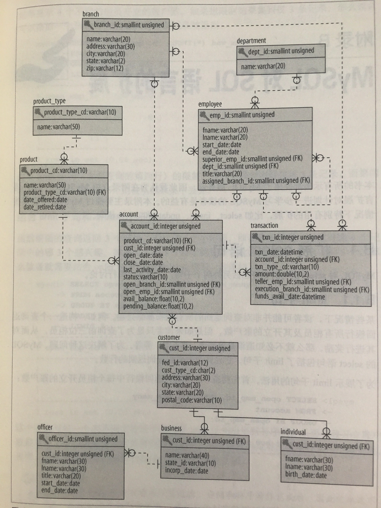

## Bank方案
在 _SQL学习指南_ 中, 为某公共银行建立一组数组表模型, 该方案中包含11个表. 表的定义如下:

表名         | 定义
----        | ----
account     | 为特定顾客开放的特定产品
branch      | 开展银行交易业务的场所
business    | 公司客户(customer 表的子类型)
customer    | 与银行有业务往来的个人或公司
department  | 执行特定银行职能的雇员分组
employee    | 银行的工作人员
individual  | 个人顾客(customer 表的子类型)
officer     | 允许为公司顾客发起商务交易的人
product     | 向顾客提供的银行服务
product_type| 具备相似功能的产品的分组
transaction | 改变账户余额的操作

银行模型的ER图
